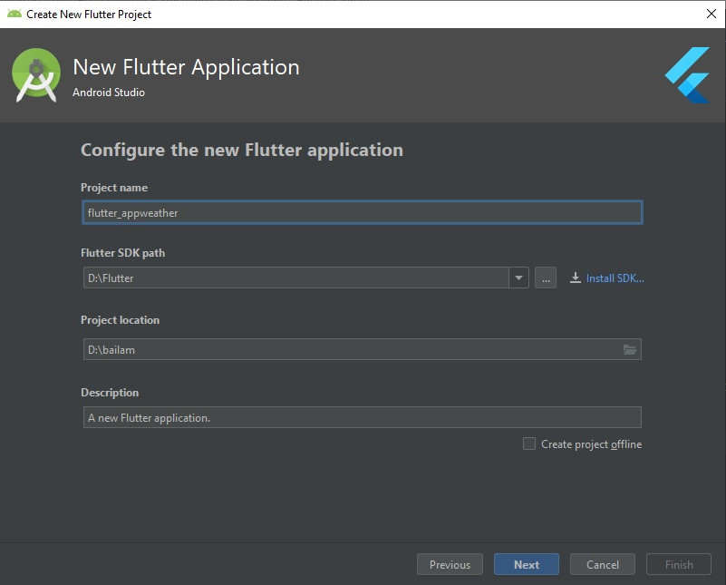
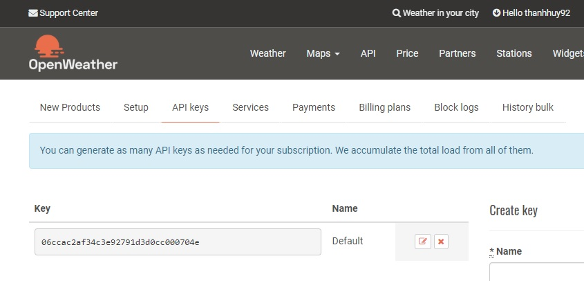
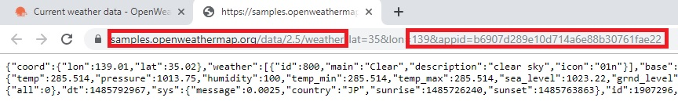
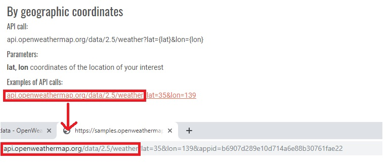

# APP WEATHER

## Giới Thiệu

* App được xây dựng bằng framework flutter (ngôn ngữ dart) và app chạy được cả Android và IOS.

* App thiết kế đơn giản với một số thông tin như nhiệt độ, độ ẩm, gió, sức ép.

* App có chức năng cho người dùng biết được thông tin thời tiết hiện tại ở nơi mình đang sống hoặc ở bất kì một nước nào đó trên trái đất chỉ cần GPS định vị được.

## Thiết Lập Dự Án

* Mở Android Studio và tạo flutter mới với tên flutter-appweather.

* Sau khi hoàn tất tạo mới thì đã có sẵn một demo flutter.

## Lấy Dữ Liệu Weather Từ API

* Vào trang https://openweathermap.org.

* Tạo tài khoản, sau khi tạo xong nó sẽ cấp cho tài khoản đó một API.

* Click vào API trên thanh menu, sau đó click vào API doc tại "Current weather data".

* Ở đây mình chọn API "By geographic coordinates" tức là lấy dữ liệu thời tiết thông qua tọa độ (lat, lon) và click vào dòng chữ được đánh khung.

* Ta sẽ thay đổi thanh địa chỉ tại vị trí được khoanh

* Thay đổi ở phần trước.

* Ở phần sau ta lấy API ở tài khoản gán vào phần sau thanh địa chỉ.

* Và ta có kết quả.

* Copy hết nội dung bên dưới, vào trang http://json2csharp.com/, paste vào "Enter JSON or a URL to JSON" và click vào "Generate".

* Được kết quả như hình dưới.

* Quay lại Android Studio, ta tạo một package tên Models (chuột phải vào lib -> New -> Package).

* Tạo một file dart tên WeatherModels trong Models (chuột phải Models -> New -> Dart File).

* Bên Json2csharp, ta copy class Coord và Weather gán vào trong file dart WeatherModels.

* Thay public -> final, thay { get; set;} -> ;.

* Thêm constructor cho class và tạo lớp mô hình theo json_serializable.

