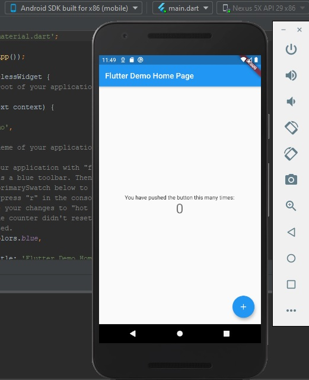
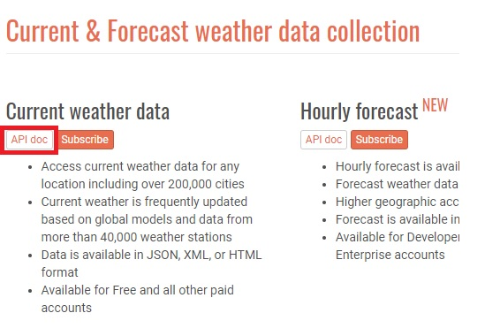
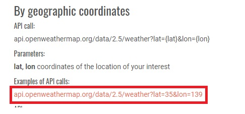
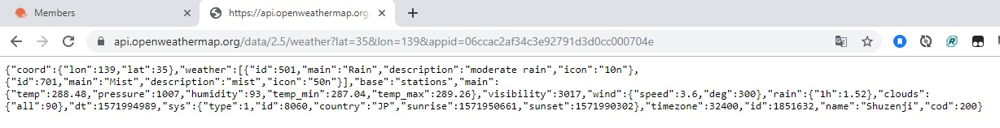
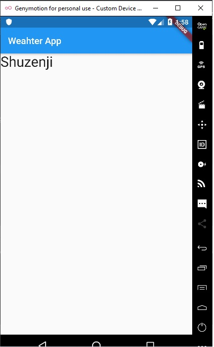

# APP WEATHER

## Giới Thiệu

* App được xây dựng bằng framework flutter (ngôn ngữ dart) và app chạy được cả Android và IOS.

* App thiết kế đơn giản với một số thông tin như nhiệt độ, độ ẩm, gió, sức ép.

* App có chức năng cho người dùng biết được thông tin thời tiết hiện tại ở nơi mình đang sống hoặc ở bất kì một nước nào đó trên trái đất chỉ cần GPS định vị được.

## Thiết Lập Dự Án

* Mở Android Studio và tạo flutter mới với tên flutter-appweather.

* Sau khi hoàn tất tạo mới thì đã có sẵn một demo flutter.

## Lấy Dữ Liệu Weather Từ API

* Vào trang https://openweathermap.org.

* Tạo tài khoản, sau khi tạo xong nó sẽ cấp cho tài khoản đó một API.

* Click vào API trên thanh menu, sau đó click vào API doc tại "Current weather data".

* Ở đây mình chọn API "By geographic coordinates" tức là lấy dữ liệu thời tiết thông qua tọa độ (lat, lon) và click vào dòng chữ được đánh khung.

* Ta sẽ thay đổi thanh địa chỉ tại vị trí được khoanh

* Thay đổi ở phần trước.

* Ở phần sau ta lấy API ở tài khoản gán vào phần sau thanh địa chỉ.

* Và ta có kết quả.

* Copy hết nội dung bên dưới, vào trang http://json2csharp.com/, paste vào "Enter JSON or a URL to JSON" và click vào "Generate".

* Được kết quả như hình dưới.

## Đưa Dữ Liệu API vào Android Studio

* Quay lại Android Studio, ta tạo một package tên Models (chuột phải vào lib -> New -> Package).

* Tạo một file dart tên WeatherModels trong Models (chuột phải Models -> New -> Dart File).

* Bên Json2csharp, ta copy class Coord và Weather gán vào trong file dart WeatherModels.

* Thay public -> final, thay { get; set;} -> ;.

* Thêm constructor cho class và tạo lớp mô hình theo json_serializable.

* json_serializable có thể nghiên cứu tại trang này https://flutter.dev/docs/development/data-and-backend/json

* Tương tự với class Main, Wind, Clounds và Sys.

* Riêng class RootObject đổi tên thành WeatherModel.

* Lớp mô hình theo json_serializable của class WeatherModel.

## Lấy Dữ Liệu API qua HTTP

* Trước tiên, cài plugin http vào file pubspec.yaml (Tệp pubspec quản lý nội dung và dependencies cho ứng dụng Flutter, nghiên cứu thêm https://dart.dev/tools/pub/pubspec).

* Vào trang https://pub.dev là nới chứa các Dart Packages, search http.

* Tab Readme cho ta biết phiên bản mới nhất của plugin http, http là gì và cách dùng http.

* Tab Example cho ta biết rõ hơn về cách dùng.

* Tab Versions là các phiên bản của plugin http.

* Tab Installing copy vùng khoanh.

* Gán vào file pubspec.yaml, nhấn vào "Packages get".

* Sau khi hoàn tất việc gán plugin http, chuyển sang file main.dart.

* Xóa hết nội dung chỉ để lại dòng import trên cùng.

* Và tạo lại main.dart mới.

* Dùng hàm bất đồng bộ (Future<void> main() async {}) để lấy dữ liệu API (http) đưa vào main.

* Và gán import.

## Thiết Kế Giao Diện

* Add code đưa dữ liệu API.

* Và chuyển đổi sang mô hình dữ liệu và hiển thị tên địa điểm trên màn hình.

* Cách xây dựng FutureBuilder xem tại đây https://api.flutter.dev/flutter/widgets/FutureBuilder-class.html

* Run và ta có tên địa điểm.

* Hiện một vài thông tin ở địa điểm đó.

* Để hiện thời gian thì phải có plugin intl (cách thực hiện như plugin http mà ta đã làm ở trên) và import intl.

* Tên địa điểm, nhiệt độ.

* Và Hình ảnh được lấy trên trang https://openweathermap.org và dùng lệnh weather[0].icon để hình ảnh được thay đổi theo thời gian.

* Thời gian.

* Tốc độ gió và sức ép.

* Độ ẩm và tọa độ.

* Run và ta có kết quả.

* Trang trí lại giao diện.

* Tạo nút thoát dùng chức năng AlertDialog để thông báo người dùng.

   

## Những Lỗi Đang Gặp

* Khi lấy lấy file từ github về và chạy.

